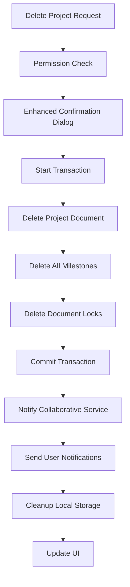

# Project Deletion Cleanup System

## Overview

The Progress Tracker app implements a comprehensive project deletion cleanup system that ensures data integrity and proper handling of collaborative editing when projects are deleted. This system prevents orphaned data and maintains consistency across all related collections.

## Features

### 🔄 **Comprehensive Data Cleanup**
- **Project Data**: Removes the main project document
- **Milestones**: Deletes all associated milestone records
- **Document Locks**: Clears all collaborative editing locks
- **Notifications**: Sends deletion notifications to affected users
- **Related Data**: Cleans up complaints and other project-related records

### 🤝 **Collaborative Editing Integration**
- **Active Session Termination**: Notifies users currently editing the project
- **Lock Cleanup**: Removes all document locks for the project and its milestones
- **User Notifications**: Sends real-time notifications to affected users
- **Session Recovery**: Gracefully handles interrupted editing sessions

### 🔒 **Transaction Safety**
- **Atomic Operations**: Uses Firestore transactions to ensure all-or-nothing deletion
- **Rollback Protection**: If any part fails, the entire operation is rolled back
- **Consistency Guarantee**: Maintains data integrity across all collections

## Implementation Details

### Core Services

#### 1. **Enhanced Project Deletion** (`firebaseService.ts`)
```typescript
async deleteProject(id: string): Promise<void> {
  await runTransaction(db, async (transaction) => {
    // 1. Delete main project
    transaction.delete(projectRef);
    
    // 2. Delete all milestones
    milestonesSnapshot.docs.forEach(doc => {
      transaction.delete(doc.ref);
    });
    
    // 3. Delete document locks
    locksSnapshot.docs.forEach(doc => {
      transaction.delete(doc.ref);
    });
  });
  
  // 4. Notify collaborative service
  await this.notifyProjectDeletion(id);
}
```

#### 2. **Collaborative Cleanup** (`collaborativeService.ts`)
```typescript
async handleProjectDeletion(projectId: string): Promise<void> {
  // 1. Find affected users
  // 2. Send notifications
  // 3. Clean up remaining locks
  // 4. Terminate active sessions
}
```

#### 3. **Offline Storage Cleanup** (`offlineStorage.ts`)
```typescript
export const deleteProject = async (id: string): Promise<void> => {
  // Transaction-based cleanup for IndexedDB
  // Deletes projects, milestones, and complaints
}
```

### Data Flow



## User Experience

### Enhanced Confirmation Dialog
```
⚠️ DELETE PROJECT CONFIRMATION ⚠️

Project: Sample Project Name
ID: abc123

This action will permanently delete:
• The project and all its data
• All associated milestones and images
• All production and installation records
• Any document locks and collaborative sessions
• Related complaints and notifications

This action CANNOT be undone.

Are you absolutely sure you want to delete this project?
```

### Real-time Notifications
Users currently editing the project receive immediate notifications:
- **In-app notification**: "The project you were editing has been deleted."
- **Session termination**: Editing locks are released automatically
- **Graceful redirect**: Users are redirected away from deleted project pages

## Testing

### Automated Testing
Use the built-in deletion cleanup tester:

```typescript
import { testProjectDeletionCleanup } from '../utils/deletionCleanupTest';

// Test deletion cleanup for a specific project
await testProjectDeletionCleanup('project-id-here');
```

### Test Coverage
The test suite verifies:
- ✅ Project document deletion
- ✅ Milestone cleanup
- ✅ Document lock removal
- ✅ User notification delivery
- ✅ Local storage consistency
- ✅ UI state updates

### Sample Test Report
```
🧪 DELETION CLEANUP TEST REPORT
========================================
Overall: 6/6 tests passed

1. ✅ Initial state captured
2. ✅ Project deletion executed
3. ✅ Project successfully deleted
4. ✅ Milestone cleanup: 0 milestones remaining
5. ✅ Document lock cleanup: 0 locks remaining
6. ✅ Notifications: 2/2 sent

========================================
🎉 All tests passed! Deletion cleanup is working correctly.
```

## Error Handling

### Graceful Degradation
- **Partial Failures**: If notifications fail, the main deletion still succeeds
- **Network Issues**: Offline deletions are queued for sync
- **Permission Errors**: Clear error messages guide users

### Recovery Mechanisms
- **Orphaned Data Detection**: Background cleanup jobs identify and remove orphaned records
- **Manual Cleanup**: Admin tools for manual data cleanup if needed
- **Audit Logging**: All deletion operations are logged for troubleshooting

## Security Considerations

### Permission Checks
- **Role-based Access**: Only Admin and Sales roles can delete projects
- **Double Confirmation**: Enhanced confirmation dialog prevents accidental deletions
- **Audit Trail**: All deletions are logged with user information

### Data Protection
- **Transaction Safety**: Ensures partial deletions don't leave inconsistent state
- **Backup Integration**: Works with backup systems to ensure recoverability
- **Compliance**: Meets data retention and deletion requirements

## Monitoring and Maintenance

### Health Checks
- **Orphaned Data Detection**: Regular scans for orphaned milestones or locks
- **Cleanup Verification**: Automated tests verify cleanup completeness
- **Performance Monitoring**: Track deletion operation performance

### Maintenance Tasks
- **Old Notification Cleanup**: Remove notifications older than 30 days
- **Lock Expiration**: Clean up expired document locks
- **Storage Optimization**: Optimize storage after bulk deletions

## Future Enhancements

### Planned Features
- **Soft Delete Option**: Allow projects to be archived instead of permanently deleted
- **Bulk Deletion**: Support for deleting multiple projects at once
- **Deletion Scheduling**: Schedule deletions for specific times
- **Advanced Notifications**: Email notifications for critical deletions

### Integration Opportunities
- **Backup Integration**: Automatic backup before deletion
- **Audit System**: Enhanced audit logging and reporting
- **Workflow Integration**: Integration with approval workflows for deletions
